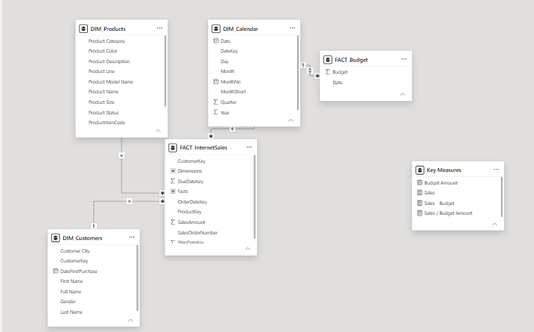
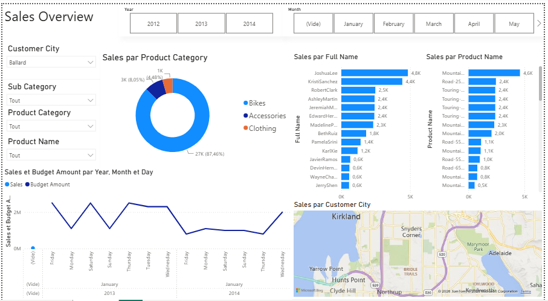

#  Sales Analysis Dashboard

## Project Overview

This project analyzes sales performance using SQL Server and Power BI.

The goal is to transform raw sales data into actionable business insights through data modeling, SQL-based data preparation, and interactive visualizations.

## Technologies Used

- SQL Server (SSMS)
- Power BI Desktop
- DAX
- Data Modeling

## Data Model

The project follows a Star Schema architecture.

### Dimension Tables

- DIM_Calendar
- DIM_Customer
- DIM_Product

### Fact Table

- FactInternetSales

## Dashboard Overview

The dashboard provides:

- Total Sales Analysis
- Sales by Product Category
- Top Customers
- Top Products
- Sales Trends
- Geographic Distribution of Sales
- Interactive Filters

## Key Insights

- Bikes represent approximately 87% of total sales.
- Revenue varies across months and seasons.
- A limited number of customers generate a significant share of revenue.
- Geographic analysis highlights high-performing regions.

## Skills Demonstrated

- SQL Querying
- Data Cleaning
- Data Modeling
- Power BI Development
- KPI Design
- Business Intelligence
- Data Visualization

## Repository Structure

Sales-Analysis-Dashboard
├── data_model
├── dashboard
├── images
└── README.md
